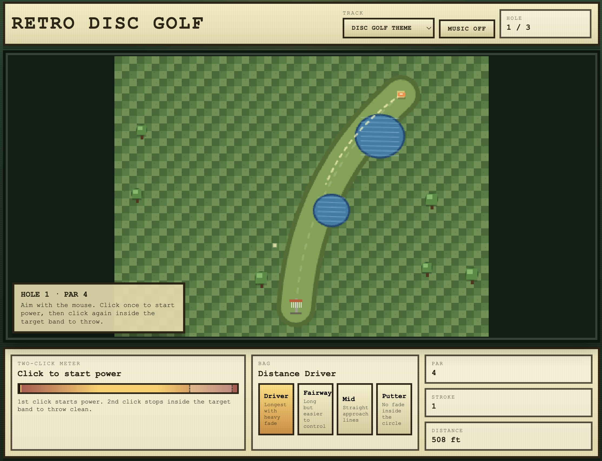

# Retro Disc Golf

A browser-based disc golf game with retro aesthetics, procedurally generated courses, and realistic disc flight physics.



## How to Play

### Objective

Complete each hole in as few throws as possible — just like real disc golf. Each round consists of 3 procedurally generated holes with par 3 and par 4 layouts featuring fairways, trees, and water hazards.

### Controls

1. **Aim** — Move your mouse to position the aiming marker on the course
2. **Start Power** — Click (or press Space) to start the power meter needle oscillating
3. **Set Power** — Click (or press Space) again to stop the needle and throw
   - Stop inside the green **target band** for a "perfect snap" (best accuracy)
   - Land near the band for a "solid release"
   - Miss the band for a "wild release" with unpredictable flight
4. **Select Disc** — Click the disc buttons in the bottom panel to switch discs before throwing

### Discs

| Disc | Distance | Curve | Best For |
|------|----------|-------|----------|
| **Driver** | Long | Heavy fade | Tee shots on long holes |
| **Fairway** | Medium-long | Moderate curve | Controlled distance shots |
| **Mid** | Medium | Minimal curve | Approach shots |
| **Putter** | Short | Straight | Getting in the basket |

### Scoring

Standard disc golf scoring relative to par:

- **Eagle** — 2 under par or better
- **Birdie** — 1 under par
- **Par** — Even
- **Bogey** — 1 over par
- **Double Bogey+** — 2 over par or worse

Hitting a **tree** or landing in **water** adds a 1-stroke penalty.

### Music

Use the track dropdown to choose between background music tracks, or toggle music off entirely.

## Running the Game

```bash
npm start
```

This starts a local HTTP server. Open the provided URL in your browser to play.

## Tech Stack

- Vanilla JavaScript (ES6 modules)
- HTML5 Canvas for rendering
- Web Audio API for procedural sound effects
- No external dependencies
